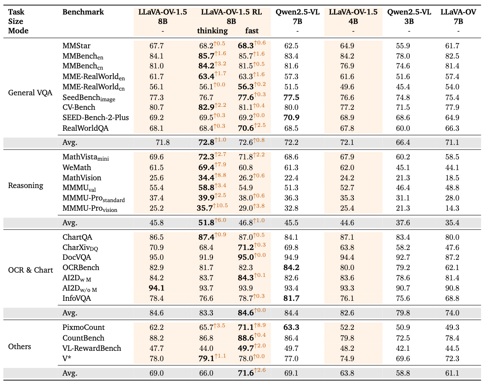

<p align="center">
  <picture>
    
  </picture>
</p>

<p align="center">
  <strong>Fully Open Framework for Democratized Multimodal Reinforcement Learning</strong>
</p>


<div align="center">

🤗 **[Models and Datasets](https://huggingface.co/)** |
📄 **[Technical Report](https://arxiv.org/abs/2509.23661)** |
📕 **[Xiaohongshu](http://xhslink.com/)**

</div>

---

<p align="center">
  <!-- License -->
  <a href="LICENSE">
    
  </a>
  <!-- PRs Welcome -->
  <a href="https://github.com/EvolvingLMMs-Lab/LLaVA-OneVision-1.5/pulls">
    
  </a>
</p>

---


## NEWS
- 2025-12-07: Released the reinforcement learning recipe of LLaVA-OneVision-1.5.

## Contents
<!-- TOC (no expansion for Quick Start Guide / Fully Reproducing Guide) -->
- [Introduction](#introduction)
- [Models](#models)
- [Datasets](#datasets)
- [Evaluation Results](#evaluation-results)
- [Evaluation](#evaluation)
- [Quick Start Guide](#quick-start-guide)
- [Contributors](#contributors)
- [Citation](#citation)
- [Acknowledgement](#acknowledgement)

## Introduction
**LLaVA-OneVision-1.5-RL** introduces a training recipe for multimodal reinforcement learning, building upon the foundation of **LLaVA-OneVision-1.5**. This framework is designed to democratize access to advanced multimodal training techniques, enabling researchers and developers to efficiently train large multimodal models with state-of-the-art performance.

#### **Superior Performance**
  - The model leads on multiple multimodal benchmarks and generally surpasses Qwen2.5-VL and the LLaVA-OneVision-1.5-Instruct.

#### **High-Quality Data**
  - We provide comprehensive data processing pipelines and filtering strategies, along with the curated datasets resulting from this process.

#### **Fully Open Framework**
  - The project releases high-quality datasets along with the complete training framework, configurations, and recipes.
  - It also provides detailed training logs and metrics to enable reproducibility and community adoption.


## Models

| Model                    | HF Link                                                                                      | Training Log |
|--------------------------|--------------------------------------------------------------------------------------------------------|-------------|
| LLaVA-OneVision-1.5-8B-RL | [🤗 HF / 8B-RL](https://huggingface.co/mvp-lab/LLaVA-OneVision-1.5-8B-RL)                | [📈 WANDB](https://huggingface.co/) |
## Datasets


| Description        | Link                                                                                                   | Status      |
|--------------------|--------------------------------------------------------------------------------------------------------|-------------|
| LLaVA-OneVision-1.5-RL-Data   | [🤗HF / RL Data](https://huggingface.co/) | Coming soon  |


## Evaluation Results


All evaluations were conducted using [lmms_eval](https://github.com/EvolvingLMMs-Lab/lmms-eval).



## Evaluation
```
# Install lmms-eval if not installed (from source is recommended)

## Fast Mode
accelerate launch --num_processes=8 --main_process_port 12399 -m lmms_eval \
    --model=llava_onevision1_5 \
    --model_args=pretrained=lmms-lab/LLaVA-OneVision-1.5-8B-RL,attn_implementation=flash_attention_2,max_pixels=3240000 \
    --tasks=mathvision_test \
    --batch_size=1

## Thinking Mode

### Modify the utils.py in the mathvision task to use the thinking prompt:
### Think and solve the following question step by step. Please put your thinking and analysis procedure within <think></think>. Put ONLY your final answer within <answer></answer>.
accelerate launch --num_processes=8 --main_process_port 12399 -m lmms_eval \
    --model=llava_onevision1_5 \
    --model_args=pretrained=lmms-lab/LLaVA-OneVision-1.5-8B-RL,attn_implementation=flash_attention_2,max_pixels=3240000 \
    --tasks=mathvision_test \
    --batch_size=1

```

## Quick Start Guide

```bash
# Clone repository
git clone https://github.com/mvp-ai-lab/LLaVA-OneVision-1.5-RL.git
cd LLaVA-OneVision-1.5-RL

# Install dependencies with uv (see https://docs.astral.sh/uv/getting-started/installation/)
uv venv --python=3.12
source .venv/bin/activate
bash install.sh

# Prepare the instruct checkpoint
mkdir pretrained
hf download lmms-lab/LLaVA-OneVision-1.5-8B-Instruct --local-dir ./pretrained/LLaVA-OneVision-1.5-8B-Instruct
cp ./3rdparty/modeling/modeling_llavaonevision1_5.py ./pretrained/LLaVA-OneVision-1.5-8B-Instruct/

# Prepare the data
mkdir data

# Demo command to create training data (optional, you can directly download from HF)
python -m dataset.create --model-name ./pretrained/LLaVA-OneVision-1.5-8B-Instruct --rollout-n 10 --dataset-name unisvg --num-workers 8 --output-dir ./data/stage2 --dataset-size 200

# Train the model
python3 -m areal.launcher.local trains/grpo.py --config configs/llavaov15-8b_stage1_grpo.yaml
python3 -m areal.launcher.local trains/grpo.py --config configs/llavaov15-8b_stage2_grpo.yaml
```

## Contributors
Thanks so much to all of our amazing contributors!

<!-- readme: collaborators,contributors,jiankangdeng/- -start -->
<table>
	<tbody>
		<tr>
            <td align="center">
                <a href="https://github.com/GeoffreyChen777">
                    
                    <br />
                    <sub><b>Changrui Chen</b></sub>
                </a>
            </td>
            <td align="center">
                <a href="https://github.com/didizhu-judy">
                    
                    <br />
                    <sub><b>Didi Zhu</b></sub>
                </a>
            </td>
            <td align="center">
                <a href="https://github.com/WinKawaks">
                    
                    <br />
                    <sub><b>Zhiyu Qu</b></sub>
                </a>
            </td>
            <td align="center">
                <a href="https://github.com/zerchen">
                    
                    <br />
                    <sub><b>Zerui Chen</b></sub>
                </a>
            </td>
            <td align="center">
                <a href="https://github.com/gkagkos">
                    
                    <br />
                    <sub><b>Polydefkis Gkagkos</b></sub>
                </a>
            </td>
		</tr>
	<tbody>
</table>
<!-- readme: collaborators,contributors,jiankangdeng/- -end -->

## Citation

If you find *LLaVA-OneVision-1.5* useful in your research, please consider to cite the following related papers:

```
@inproceedings{LLaVA-OneVision-1.5,
  title={LLaVA-OneVision-1.5: Fully Open Framework for Democratized Multimodal Training},
  author={An, Xiang and Xie, Yin and Yang, Kaicheng and Zhang, Wenkang and Zhao, Xiuwei and Cheng, Zheng and Wang, Yirui and Xu, Songcen and Chen, Changrui and Zhu, Didi and Wu, Chunsheng and Tan, Huajie and Li, Chunyuan and Yang, Jing and Yu, Jie and Wang, Xiyao and Qin, Bin and Wang, Yumeng and Yan, Zizhen and Feng, Ziyong and Liu, Ziwei and Li, Bo and Deng, Jiankang},
  booktitle={arXiv},  
  year={2025}
 }

@inproceedings{xie2025region,
  title={Region-based Cluster Discrimination for Visual Representation Learning},
  author={Xie, Yin and Yang, Kaicheng and An, Xiang and Wu, Kun and Zhao, Yongle and Deng, Weimo and Ran, Zimin and Wang, Yumeng and Feng, Ziyong and Miles, Roy and Elezi, Ismail and Deng, Jiankang},
  booktitle={ICCV},
  year={2025}
}

@article{lillava,
  title={LLaVA-OneVision: Easy Visual Task Transfer},
  author={Li, Bo and Zhang, Yuanhan and Guo, Dong and Zhang, Renrui and Li, Feng and Zhang, Hao and Zhang, Kaichen and Zhang, Peiyuan and Li, Yanwei and Liu, Ziwei and Li, Chunyuan},
  journal={Transactions on Machine Learning Research}
  year={2024}
}
```

## Acknowledgement

- AReaL: Lightning-Fast RL for LLM Reasoning and Agents. Made Simple & Flexible. — [AReaL](https://github.com/inclusionAI/AReaL)
- sglang: SGLang is a fast serving framework for large language models and vision language models. — [sglang](https://github.com/sgl-project/sglang)
- lmms-eval: A standardized evaluation framework for Large Multimodal Models — [lmms-eval](https://github.com/EvolvingLMMs-Lab/lmms-eval)
- LLaVA: Large Language-and-Vision Assistant — [LLaVA](https://github.com/haotian-liu/LLaVA)
- LLaVA-NeXT: Next-generation multi-modal assistant — [LLaVA-NeXT](https://github.com/LLaVA-VL/LLaVA-NeXT)
